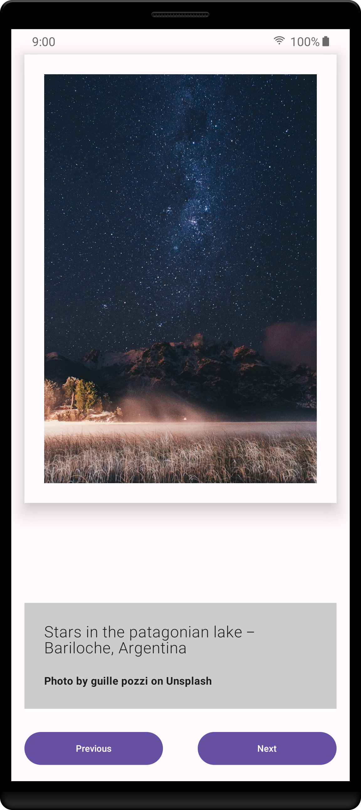

# Art Space

Art space is a simple digital art app, which displays a number of art works, its description and 
credits, and two buttons to navigate between the art works.

It is a training project of the [Android Basic with Compose](https://developer.android.com/courses/android-basics-compose/course) from Google.

Open project's page: [Create an Art Space app](https://developer.android.com/codelabs/basic-android-kotlin-compose-art-space?authuser=1&continue=https%3A%2F%2Fdeveloper.android.com%2Fcourses%2Fpathways%2Fandroid-basics-compose-unit-2-pathway-3%3Fauthuser%3D1%23codelab-https%3A%2F%2Fdeveloper.android.com%2Fcodelabs%2Fbasic-android-kotlin-compose-art-space#0)

Primary files: 

- [ArtWork.kt](app/src/main/java/com/practice/artspace/ArtWork.kt) -> A data class which represents 
an artwork. It takes the drawable resource of the artwork, the string resource of the art work's description,
and the string resource of the art work's credit info.

- [MainActivity.kt](app/src/main/java/com/practice/artspace/MainActivity.kt) -> This file contains the UI and logic. You can run the app by clicking the run button within this file.

**Screenshot of the app:**

